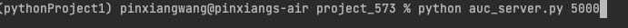
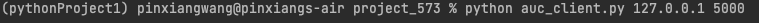
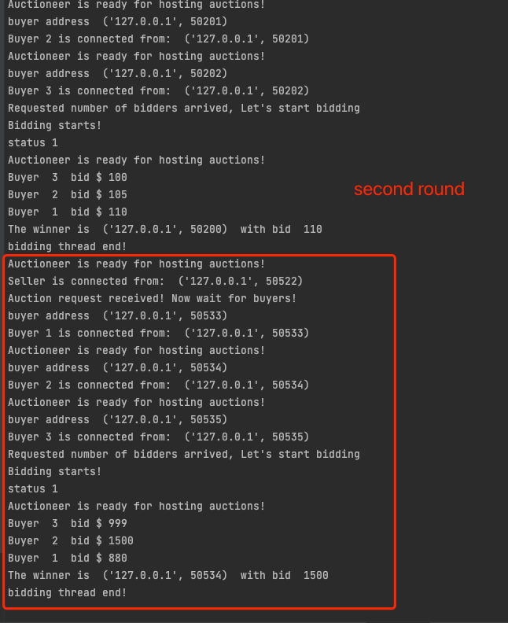
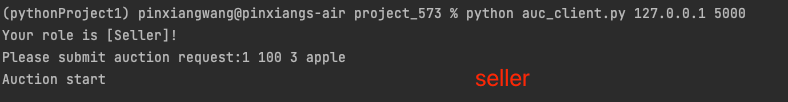
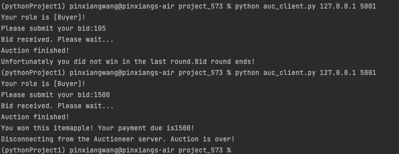
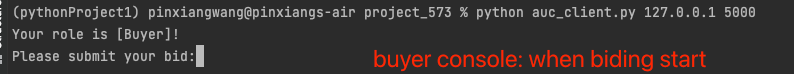
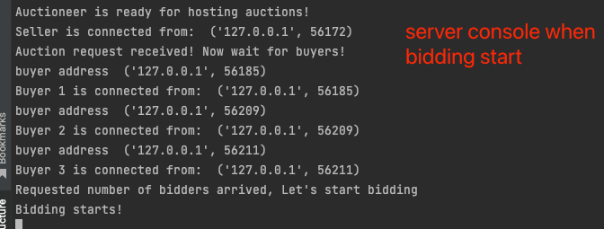
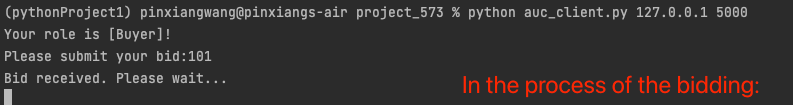
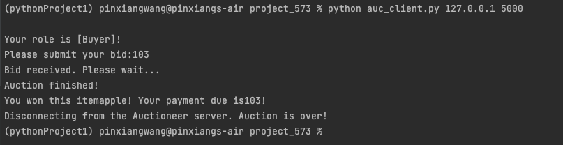

# project_573
Name: Pinxiang Wang \
Unity ID: pwang25 \
Command to Run the server: \

Command to Run the client: \

In the project, I use 2 new threads to block any future connection in the seller setup statge
and out number buyer connection stage. 

When you start a normal client when the seller connection has built up, it supposed to be assigned
as a buyer, however since the independent blocking thread has content not flushing, it would suggeset
as 'Server is busy, please try again later.'

It will not influence the future behavior of this system just restart the client using the command above
again, and it will work normally.

Biding Finished:
