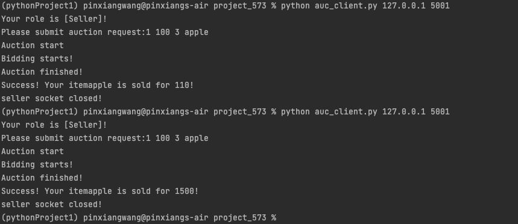

# project_573
Name: Pinxiang Wang \
Unity ID: pwang25 \
Command to Run the server: \

Command to Run the client: \

Server console sample output （ One round）:

Server console sample for holding next round (First round end, holding next round):

Seller Console sample output:

Buyer Console sample output:
